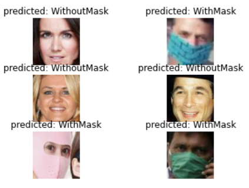

# Face Mask Detection

## Introduction

COVID-19 is a contagious disease caused due to a virus, which appears to spread from one person to another person through close contact. This outbreak in today’s world has disastrous effects, which may sometimes lead to the death of a person. The covid-19 has caused panic among the society and to avoid it preventive measures should be followed to protect oneself. WHO suggested general public to follow measures such as washing hands frequently, keep six feet distance from one another, wearing mask at public places and avoiding stepping out of home. Many research studies proved that wearing a mask reduces the risk of getting infected by the covid-19 virus. Deep learning is useful tool that can be used to track the wearing of mask. 

To protect oneself and save the lives of others, it is necessary to put on a mask in public places. To reduce the risk and further spread of disease, a deep learning face detector model is built to detect if a person is properly wearing a face mask. The face mask detector model consists of two phases - first phase is building the convolutional neural network using the image dataset and the second phase is real-time capturing the video from the camera and detecting if the person is wearing a mask or not. This project will be useful for tracking the safety measures for wearing mask. 
 	

## Related Work

[1] proposed a dual-stage CNN architecture for the face mask detection that detects human face using RetinaFace model, that performed better than Dlib DNN and MTCNN models. In the second phase NASNetMobile classified faces as masked or unmasked better than the DenseNet121 and MobileNetV2. The system has ability to identify multiple faces mask in the image and can be further extended to port to machine learning models to its TensorFlow Lite versions. In the experiments conducted by [2] in generating accurate face segmentation masks from any size of input image, predefined training weights of VGG-16 architecture is used to extract the features and make predictions. This fully convolution networks (FCN) consist of 17 convolutional layers and 5 max pooling layers. The system shows the identified faces within bounding circle with respect to pixel level accuracy. Also, refined predicted masks are shown after they are subjected to post processing. The proposed FCN model separates facial spatial location along with a particular label. The post processing for detecting facial masks given greater boost to a mean pixel level accuracy. This system can identify both non frontal and multiple faces from single image, which can find its advanced implications in detecting facial part.

A hybrid deep transfer learning model with machine learning models is built to detect face mask [3]. The first part is designed using Resnet50 for feature extraction and the second component is designed using classical machine learning classifiers such as decision trees, Support Vector Machine (SVM), and ensemble learning for classifying the face masks. Comparison of the algorithms is done to find the best suitable algorithm with highest accuracy and is efficient in training and detection processes. The authors achieved the highest accuracy with the least time consumed in the training process with SVM classifier. In future, neutrosophic domain can used in classifying and detecting tasks. In [4], PCA (Principal Component Analysis) is implemented for facial feature extraction in detecting masked and non-masked faces. The study showed face without mask gave better recognition rate, while for masked face gave poor. It is concluded that feature extraction using PCA for masked face is not effective than non-masked face.

## Selected Dataset

Face Mask Dataset is taken from the Kaggle site. The dataset consists of images of people with mask and without mask. The image dataset consists of 12k images. The images are divided into test, train, and validation. Each folder contains images which are further grouped into WithMask and WithoutMask.

Dataset can be found [**here**.](https://www.kaggle.com/ashishjangra27/face-mask-12k-images-dataset)

Sample Dataset: 

Figure 1: Sample images from the image dataset

## Convolutional Neural Network (CNN)

Convolutional Neural Network (CNN) is a deep learning algorithm which is applied to visualize the images. CNNs are more of a regularized class of multilayer perceptron’s. CNNs are specialized type of neural networks that employs convolution operations instead of matrix multiplication at least in one CNN’s layers. CNN consists of input, output, and hidden layer. The hidden layer consists of convolutional layer that convolves either multiplication or dot product. The input image given to CNN is assigned weights and biases to different aspects of input, based on which network can make differentiations one from another. The major role of ConvNet is to reduce the image size into a shape that is easy to process, without the loss of image critical features for making better prediction. Every neuron in one layer is connected to every neuron in another layer in a fully connected layer. CNN is basically designed to work with two-dimensional image data, although it can be used with one- and three-dimensional images.

## OpenCV

OpenCV (Open Source Computer Vision) is a computer vision and machine learning library which is freely available. It is built to offer basic computer Vision applications and to elevate the usage of machine learning in commercial outcomes. It is written in C++ language and its interface is in C++. OpenCV is used for the analysis of images and videos like reading license plate, face recognition and identification, advanced robotic vision, editing photo and many more. This library runs on various operating systems like Linux, OpenBSD, macOS, Windows, NetBSD, FreeBSD.

## System Architecture

### Model-1:

In the first phase, Model 1 is trained on face mask image dataset using a single convolutional neural layer. The image data is preprocessed by transforming it to tensors and performed normalization before feeding to the neural model. The processed data passed to convolutional layer creates feature map that summarizes detected features in the input. BatchNorm2D calculates mean and variance of input features and does normalization. Further, outputs are passed through Rectified Linear Unit (ReLU) activation function. It is the most used activation function. ReLU helps neural model to learn faster and perform better by overcoming the problem of vanishing gradient. This function allows model to account for non-linearities and interactions. And then it is passed through MaxPool2D layer. This layer takes the maximum value over window defined with pool size for individual dimension along with the feature axis. Next, output of MaxPool2D layer is parsed through fully connected neural layer consisting of flatten, linear and ReLU layer. This layer flattens and applies weights outputting probabilities that determines whether the input image is WithMask or WithoutMask. 

In the second phase, the trained neural model is then deployed to capture real-time video and make analysis using OpenCV which is a computer vision and machine learning library. Here, the video is analyzed to detect if a person is wearing mask or not. Model-2 follows the same training and real-time video detection steps as Model-1. Model-2 consists of four convolutional layers, four ReLU layers, two max pooling layers, and a fully connected neural layer. This model is built without BatchNorm2D layer. Similarly, Model-3 has the same procedural steps as Model-1 and Model-2. However, it is built with six convolutional layers, six BatchNorm2D layers, two ReLU layers, two max pooling layers and a fully connected neural layer.

Figure 2: Simple single layer convolutional neural network

### Model-2:

Figure 3: 4 convolutional, 2 max pooling and fully connected layer neural network

### Model-3:

Figure 4: 6 convolutional, 2 max pooling and fully connected layer neural network with Sigmoid activation

### Saved Models (*.pth)

[Model 1](https://drive.google.com/file/d/1VRm9dqkaVHw0PJYf3d8V8DyOo5Aa5qnT/view?usp=sharing)
[Model 2](https://drive.google.com/file/d/1X0RdyDB28aFV0vkUBjj-rMQPOeSoOlno/view?usp=sharing)
[Model 3](https://drive.google.com/file/d/1Ue59qck_VeDcwqY59bbW627mvm-R5PHt/view?usp=sharing)

## Results and Conclusion

The models are trained using 10k image samples, validated on 800 image samples and tested on 992 image samples. The models are trained with 10 epochs using learning rate of 1e-3.

  
  
  

Figure 5: Loss, Accuracy, Predictions on Test Data using Model-1

The accuarcy of Model-1 on the validation dataset is 0.99 and validation loss is 0.02. The accuracy on the test dataset is 0.96. The true positives of the model are 508, true negatives are 441, false positive is 1, and false negatives are 42. From Figure 5, the accuracy remained stable after epoch 7. 

  
  
  

Figure 6: Loss, Accuracy, Predictions on Test Data using Model-2

The accuarcy of Model-2 on the validation dataset is 0.98 and validation loss is 0.04. The accuracy on the test dataset is 0.90. The true positive of the model are 420, true negatives are 474, false positives are 89, and false negatives are 9. The false positives obtained from this model are higher when compared to Model-1. From which we can conclude that Model-1 performed better than Model-2.

  
  
  

Figure 7: Loss, Accuracy, Predictions on Test Data using Model-3

The accuarcy of Model-3 on the validation dataset is 0.99 and validation loss is 0.02. The accuracy on the test dataset is 0.97. The true positives of the model are 480, true negatives are 483, false positive are 29, and false negatives are 0. When Model-1 and Model-3 are compared, the accuracy of Model-1 is less than Model-3, but Model-1 has less false positives as compared to Model-2. Hence, it can be concluded that Model-1 has performed comparitively better than Model-3.

Model-2 and Model-3 are complex models and have more number of neural layers. Whereas, Model-1 is the simplest with a single convolutional layer. So, it can be concluded that to achive best accuracy it is not always the case that complex models give best results.  Model-1 is the best performing model.

## Demo for real-time face mask detection 

## References

[1] Chavda, Amit & Dsouza, Jason & Badgujar, Sumeet & Damani, Ankit. (2020). Multi-Stage CNN Architecture for Face Mask Detection.

[2] T. Meenpal, A. Balakrishnan and A. Verma, "Facial Mask Detection using Semantic Segmentation," 2019 4th International Conference on Computing, Communications and Security (ICCCS), Rome, Italy, 2019, pp. 1-5, doi: 10.1109/CCCS.2019.8888092.

[3] Loey, M., Manogaran, G., Taha, M., & Khalifa, N. (2021). A hybrid deep transfer learning model with machine learning methods for face mask detection in the era of the COVID-19 pandemic. Measurement : journal of the International Measurement Confederation, 167, 108288. https://doi.org/10.1016/j.measurement.2020.108288

[4] M. S. Ejaz, M. R. Islam, M. Sifatullah and A. Sarker, "Implementation of Principal Component Analysis on Masked and Non-masked Face Recognition," 2019 1st International Conference on Advances in Science, Engineering and Robotics Technology (ICASERT), Dhaka, Bangladesh, 2019, pp. 1-5, doi: 10.1109/ICASERT.2019.8934543.

[5] Ali Waqas. (June, 2020). “course-project-mask-detection”. Retrieve from: https://jovian.ai/aliwaqas333/course-project-mask-detection
